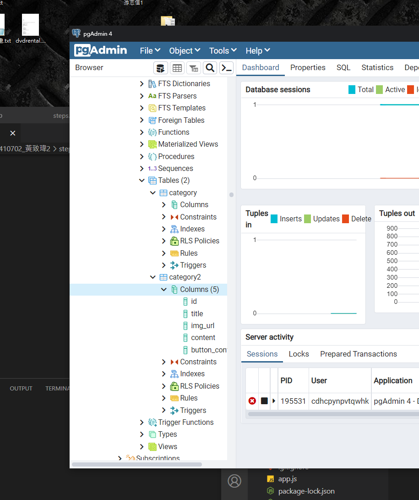
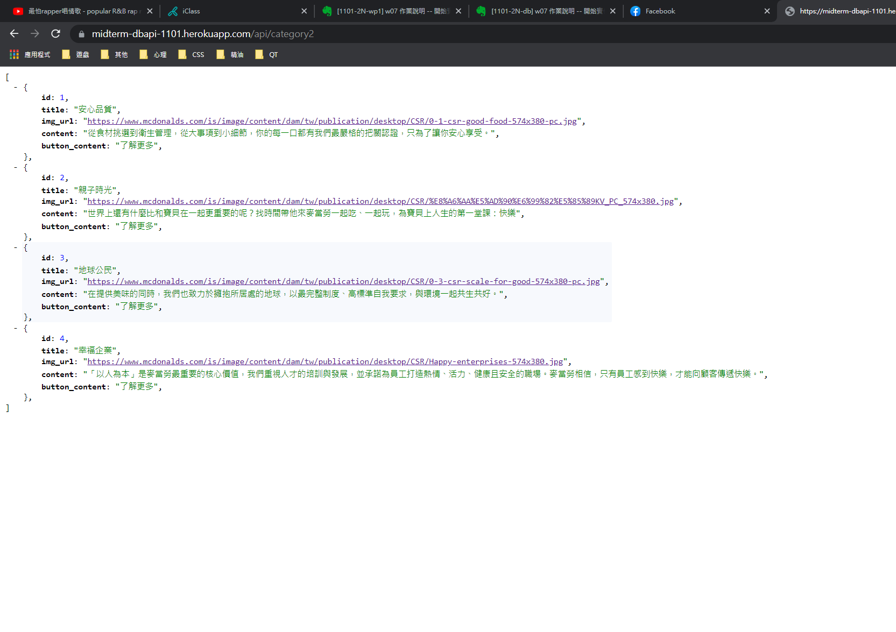

# 實作過程

由於提前做完就沒有先截圖片段，以下用程式碼呈現


##1.
app.js
```
var createError = require('http-errors');
var express = require('express');
var path = require('path');
var cookieParser = require('cookie-parser');
var logger = require('morgan');
const cors = require('cors');

var indexRouter = require('./routes/index');
var usersRouter = require('./routes/users');
const api_Router=require('./routes/api')

var app = express();

// view engine setup
app.set('views', path.join(__dirname, 'views'));
app.set('view engine', 'ejs');

app.use(logger('dev'));
app.use(express.json());
app.use(express.urlencoded({ extended: false }));
app.use(cookieParser());
app.use(express.static(path.join(__dirname, 'public')));

app.use('/', indexRouter);
app.use('/users', usersRouter);
app.use('/api', cors(),api_Router)


// catch 404 and forward to error handler
app.use(function(req, res, next) {
  next(createError(404));
});

// error handler
app.use(function(err, req, res, next) {
  // set locals, only providing error in development
  res.locals.message = err.message;
  res.locals.error = req.app.get('env') === 'development' ? err : {};

  // render the error page
  res.status(err.status || 500);
  res.render('error');
});

app.use(
  cors({
    origin: ['https://midterm-dbapi-1101.herokuapp.com/']
  })
);

module.exports = app;

```
##2.

### apiController2.js
```
const serviceController2 = require('../services/serviceController2');

exports.getCategories = async (req, res) => {
  try {
    const data = await serviceController2.getCategories();
    return res.json(data);
    
  }catch (err) {
    console.log('Controller getCategories', err);
  }
};

```
##3.

### serviceController2.js
```
const Category2 = require('../models/Category2');

exports.getCategories = async (req, res) =>{
    try{
        return await Category2.fetchAll(); 

    }catch(err){
        console.log('getCategories',err);
    }
}
```
##4.

### Category2.js
```
const db = require("../utils/database");

const Category2 = class Category2{
    constructor(id, img_url ,title ,content, button_content){
        this.id=id;
        this.img_url=img_url;
        this.title=title;
        this.content=content;
        this.button_content =button_content;
    }

    static async fetchAll(){
        try{
            let results = await db.query(`SELECT * from category2`);
            return results.rows;
        } catch (e){
            console.log('error',e);
        }
    }
};

module.exports = Category2;
```

##5.

