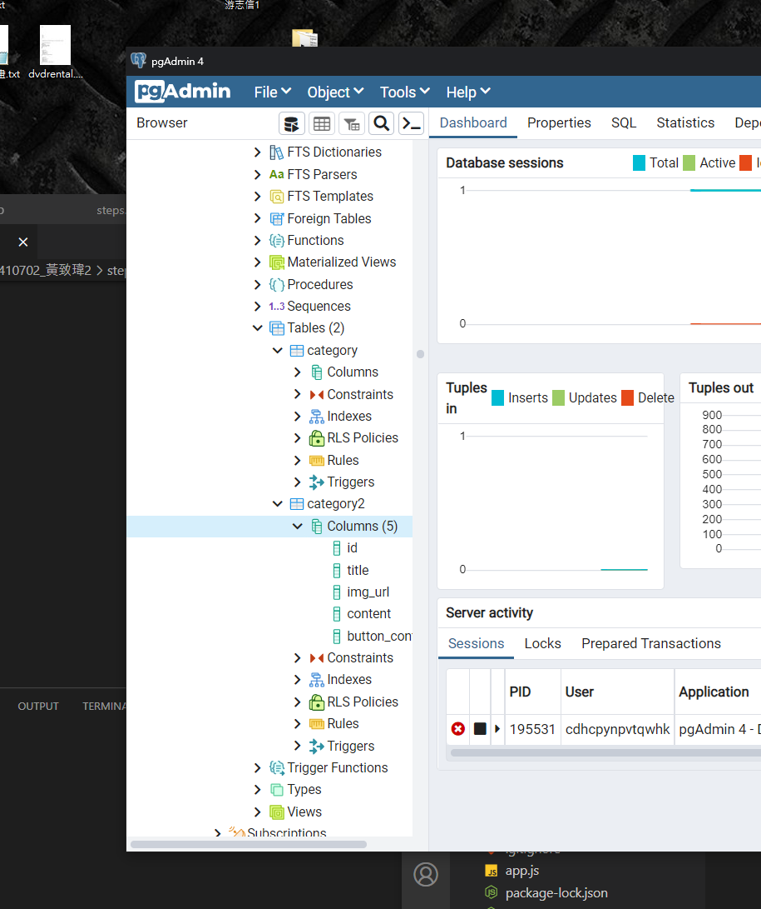
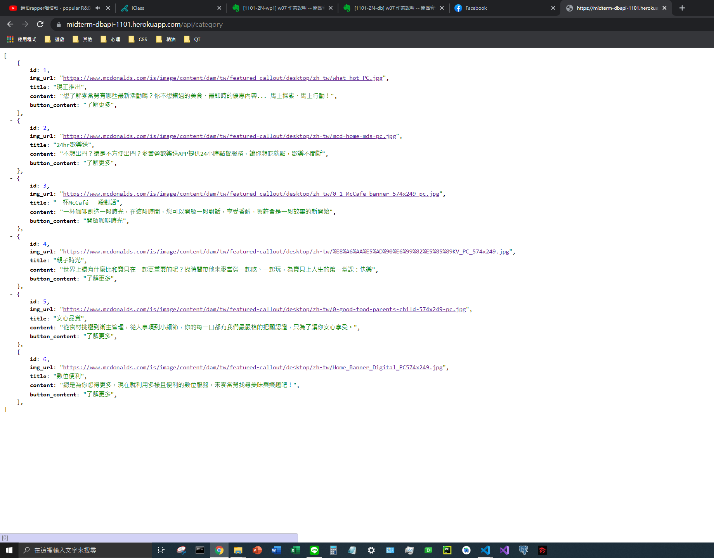

# 實作過程

由於提前做完就沒有先截圖片段，以下用程式碼呈現


##1

### database.js

```
const { Pool } = require('pg');
let pool;
const isProduction = process.env.NODE_ENV === 'production';

if (isProduction) {
  pool = new Pool({
    connectionString: process.env.DATABASE_URL,
    ssl: { rejectUnauthorized: false },
  });
} else {
  pool = new Pool({
    user: 'postgres',
    host: 'localhost',
    database: 'd7qtraoo3tsfjb',
    password: '0000',
    port: '5432',
  });
}

module.exports = pool;
```

##2.

### apiController.js
```
const serviceController = require('../services/serviceController');

exports.getCategories = async (req, res) => {
  try {
    const data = await serviceController.getCategories();
    return res.json(data);
    
  }catch (err) {
    console.log('Controller getCategories', err);
  }
};


```

##3.

### Category.js
```
const db = require("../utils/database");

const Category = class Category{
    constructor(id, img_url ,title ,content, button_content){
        this.id=id;
        this.img_url=img_url;
        this.title=title;
        this.content=content;
        this.button_content =button_content;
    }

    static async fetchAll(){
        try{
            let results = await db.query(`SELECT * from category`);
            return results.rows;
        } catch (e){
            console.log('error',e);
        }
    }
};


module.exports = Category;


```

##4.

### serviceController.js

```
const Category = require('../models/Category');

exports.getCategories = async (req, res) =>{
    try{
        return await Category.fetchAll(); 

    }catch(err){
        console.log('getCategories',err);
    }

}
```
##5.

picture


